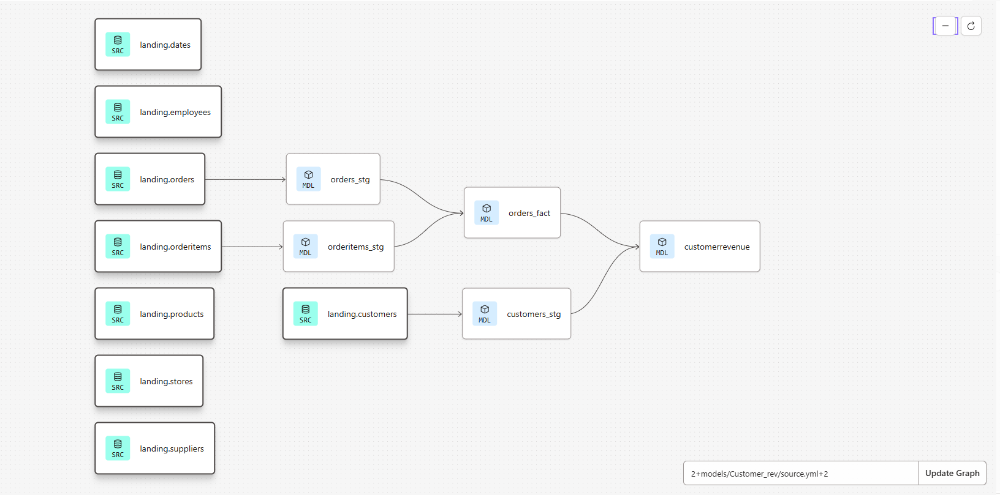

# dbt-snowflake-supermarket-analytics

## 📌 Project Overview

This project is a **learning-focused data analytics pipeline** built using **dbt-core** and **Snowflake**, with version control managed via **GitHub**.  
The goal of the project is to design an **end-to-end analytics workflow** that identifies **top-performing customers** in a supermarket business based on **order count** and **revenue**.

This repository demonstrates:
- Practical usage of **dbt models and lineage**
- Layered data modeling (sources → staging → fact → marts)
- Integration of **Snowflake with dbt**
- Git-based version control for analytics engineering workflows

---

## 🧠 Prerequisites & Background

Before starting this project, I had:
- Prior knowledge of **Snowflake**
- Experience using **Git & GitHub**
- Beginner-level understanding of **dbt**, which is expanded through this project

---

## 🛠️ Tech Stack

- **Data Warehouse:** Snowflake  
- **Transformation Tool:** dbt-core  
- **Version Control:** GitHub  
- **Data Domain:** Supermarket transactional data  

---

## 📂 Data Description

Sample supermarket data was created and ingested into Snowflake, including:

- Customers  
- Orders  
- Order Items  
- Products  
- Stores  
- Suppliers  
- Employees  
- Dates  

The raw data is stored in **landing tables** inside Snowflake and used as dbt sources.

---

## 🧱 Data Modeling Approach

The project follows standard dbt modeling layers:

### 1️⃣ Sources (Landing Layer)
Raw tables loaded into Snowflake:
- `landing.orders`
- `landing.orderitems`
- `landing.customers`
- `landing.products`
- `landing.stores`
- `landing.suppliers`
- `landing.employees`
- `landing.dates`

These tables are defined as **dbt sources**.

---

### 2️⃣ Staging Layer
Light transformations and standardization:
- `orders_stg`
- `orderitems_stg`
- `customers_stg`

This layer prepares clean, analytics-ready data.

---

### 3️⃣ Fact Layer
Core transactional model:
- `orders_fact`

This model combines orders and order items to calculate metrics such as:
- Total revenue
- Order counts per customer

---

### 4️⃣ Mart / Final Models
Business-focused output:
- `customerrevenue`

This model identifies **top-performing customers** based on:
- **Total order count**
- **Total revenue**

---

## 📊 Business Logic

Top-performing customers are determined using:
- **Order Count**
- **Revenue**


---

## 🔁 dbt Lineage Graph

The following lineage diagram shows the complete data flow from **Snowflake sources** to **final analytics models**:



This visual highlights:
- Source-to-model dependencies
- Layered transformation design
- How final insights are derived from raw data

---

## ▶️ How to Run (Lightweight)

```bash
dbt debug +customerrevenue
dbt run +customerrevenue
